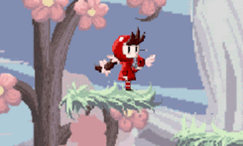
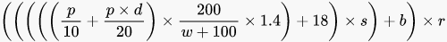

La GT est une communauté autour du jeu vidéo, les membres de cette communauté ayant des talents très variés (programmation, game design, art...), nous avons voulu créer un jeu ensemble.

Le GT Fighting Game est donc un platform fighter (ou un Smash Bros. Like) où chaque membre de la communauté peut penser les mécaniques et le design de son propre personnage, ensuite on travaille tous ensemble sur la création de ce personnage.

Ce projet a été commencé au mois d'août 2021 et mis au ralenti avec la rentrée scolaire. Les fonctionnalités principales comme le système de mouvement, quelques attaques, l'éjection proportionnelle aux dégâts et le hitstun sont mises en place.

Pour recréer l'éjection, j'ai cherché sur internet les formules utilisées dans la série Super Smash Bros. et j'ai retenu celle utilisée dans Super Smash Bros. Ultimate, soit :

- où **p** est le total des dégâts de l'adversaire après avoir encaissé le coup,

- **d** représente les dégâts infligés par le coup,

- **w** représente le poids de la cible,

- **s** représente l'évolution de l'éjection liée au coup,

- **b** représente l'éjection par défaut du coup,

- **r** représente divers modificateurs liés par exemple aux objets, je l'ai ignoré jusqu'à présent.

Ce projet est développé entièrement sur Unity, je m'y occupe de la programmation et du game design.