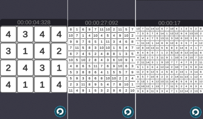
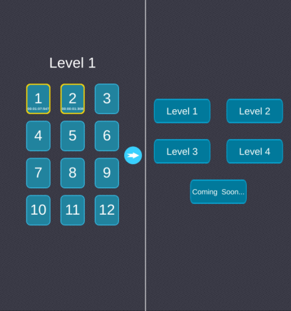

Hitori est une reproduction du [jeu de logique japonais du même nom](https://fr.wikipedia.org/wiki/Hitori) au format d'un jeu mobile.

J'ai commencé ce projet pour avoir une première expérience de création sur un jeu mobile et potentiellement sur la publication d'un jeu sur les stores.

Le jeu se présente comme une série de grilles de Hitori avec une taille croissante selon le niveau.

J'ai réalisé ce projet seul sur Unity en C#, entre octobre et novembre 2021.