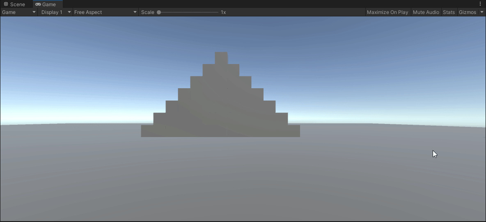

Ces prototypes ont été créés en 6h pour des cours ou des examens sur Unity à Rubika.

- 13 Décembre 2020 : Shoot'em up

- 2 novembre 2020 : Casse-Briques

- 20 octobre 2020 : FPS

- 28 septembre 2020 : Onde de choc + bombe volante

- 20 septembre 2020 : Flipper

