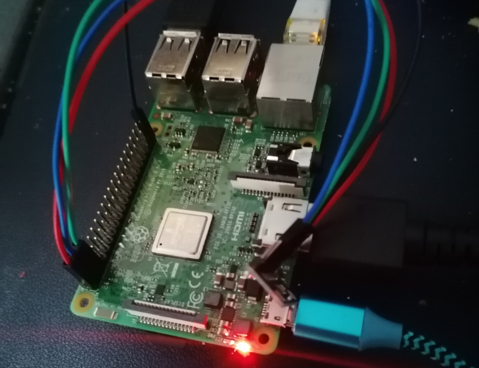
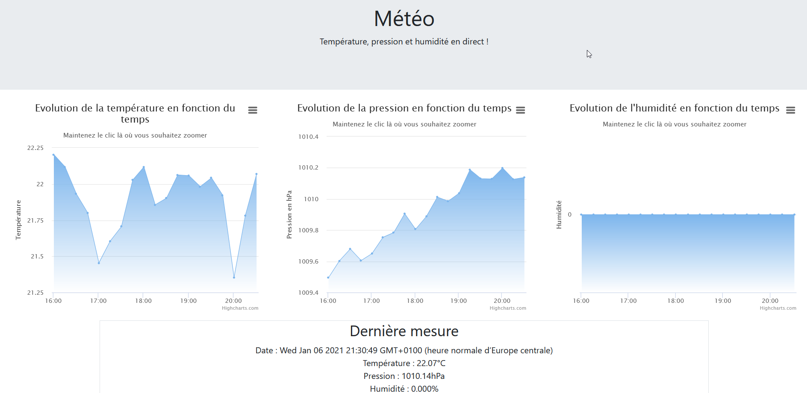

La station météo est un projet proposé par le CNED dans le cadre de la deuxième année de BTS Systèmes Numériques. Il consiste à exploiter un Raspberry Pi 3, l'api QT5, un capteur de pression, de température et d'humidité afin d'obtenir un site web affichant ces données sur un graphique.

QT5 et le langage C++ m'ont permis de récupérer les données via le capteur relié aux ports GPIO du raspberry Pi.

*l'humidité reste à 0 à cause d'un défaut sur le capteur utilisé*

Pour intérepréter les données sur une page web, j'ai utilisé Javascript/JQuery, Ajax/JSON, ainsi que les API Hightcharts et Bootstrap.

J'ai réalisé ce projet seul du début à la fin, puisque les cours du CNED se font uniquement par correspondance.