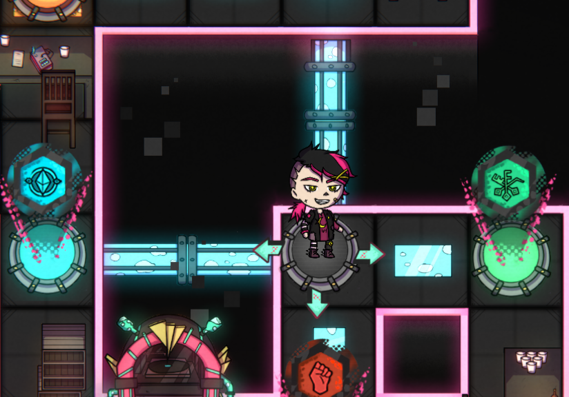
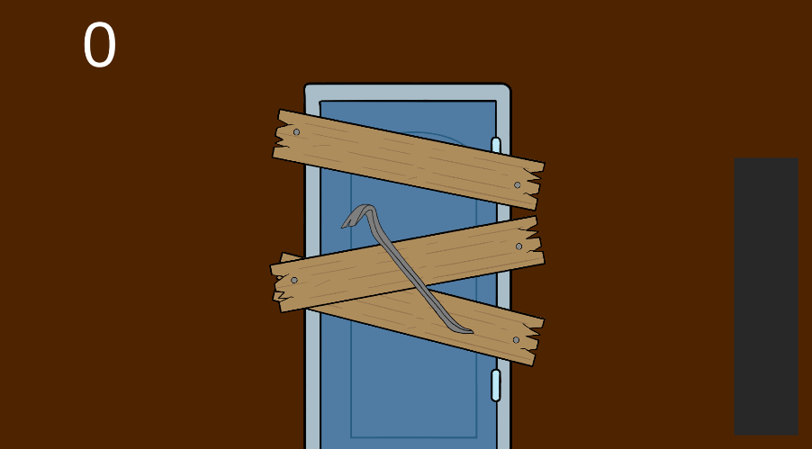

L'année de bachelor Game Programming à Rubika comprend un projet de Wario Ware like s'étalant de octobre 2021 à fin janvier 2022.

Ce projet est réalisé en coopération entre la filière Game Programming et la fillière Game Design, soit environ 40 élèves. L'organisation du projet est pensée pour reproduire l'organisation d'un studio, avec des trios chargés de développer les mini-jeux du Wario-Ware, des team leaders et des responsable du macro-jeu.

Dans ce projet je remplit le rôle de membre de trio. Chaque trio doit produire au moins 3 mini-jeux, pour l'instant je gère la partie programmation de 2 de ces mini-jeux, et je suis à l'origine du concept de l'un d'eux.

Chacun des mini-jeux doit s'articuler autour de deux valeurs fournies par le macro-jeu : La difficulté et la vitesse du jeu.

voici les mini-jeux sur lesquels je travaille, ce n'est pas leur version finale, mais c'est sous cette forme qu'ils devraient apparaître dans l'alpha du projet prévue au 7 janvier 2022.

**Dans l'Ombre du Chariot**

Dans ce mini-jeu, le joueur doit traverser un couloir en se cachant derrière un chariot, pour éviter que le garde ne le repère à l'aide de sa lampe torche. S'il traverse le couloir sans se faire repérer, il a gagné, si il se fait repérer ou que le chariot traverse sans lui, il a perdu. Je suis à l'origine du concept de ce mini-jeu.

La difficulté impacte la taille du chariot et son comportement :
- Au niveau 1 le chariot est large et traverse en ligne droite à une vitesse constante
- Au niveau 2 le chariot est large mais s'arrête à un moment aléatoire pendant sa course, ce qui force le joueur à s'arrêter lui aussi
- Au niveau 3 le chariot est plus petit, et s'arrête de la même façon qu'au niveau 2

La vitesse impacte de la même façon la vitesse du chariot et celle du joueur.

**Pied au Plancher**

Dans ce mini-jeu, le joueur doit retirer une par une des planches qui bloquent une porte en mashant un bouton. Si il enlève toutes les planches avant la fin du temps imparti, il a gagné, sinon il a perdu.

La difficulté impacte le nombre de planches à enlever, de 3 à 7.

La vitesse impacte le temps imparti pour retirer les planches, la vitesse de mouvement du pied-de-biche et la vitesse à laquelle il peut masher le bouton.