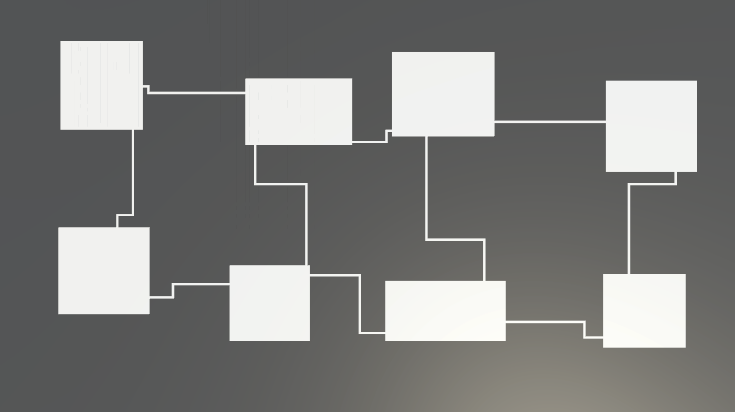
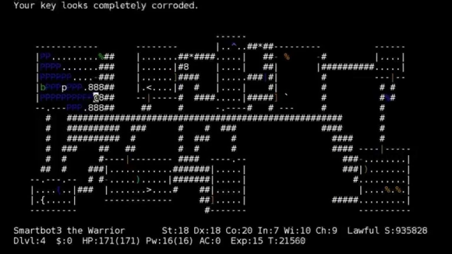

Pokémon Donjon Mystère est une série de roguelike en tour par tour. Je suis cette série depuis longtemps, et recréer son système de génération de niveaux me semblait être une bonne occcasion d'en apprendre plus sur la génération procédurale.

Après quelques recherches sur internet, j'ai découvert que le jeu utilisait une technique de "partitionnement de l'espace" : la carte est divisée en X lignes et Y colonnes, ensuite chaque division décide soit de créer une salle, de créer un point seul qui servira à connecter les salles entre elles, ou de ne rien créer du tout. Ensuite chaque salle a une chance d'être connectée à une autre salle proche. Malheureusement cette technique crée beaucoup de cartes invalides à cause de salles qui restent innaccessibles. Cette technique a surtout été popularisée par le jeu Nethack :

Il y a beaucoup de "sets de règles" possibles dans le jeu original, par exemple ceux qui forcent des salles larges et proches pour rendre le jeu plus facile, ou à l'inverse des salles plus petites et distantes pour monter la difficulté. Ici j'ai créé un set de règles pour une partie plutôt facile, mais un système de Scriptable Objects me permet d'en créer de nouveaux facilement.

Ce projet a été développé entièrement sur **Unity**.