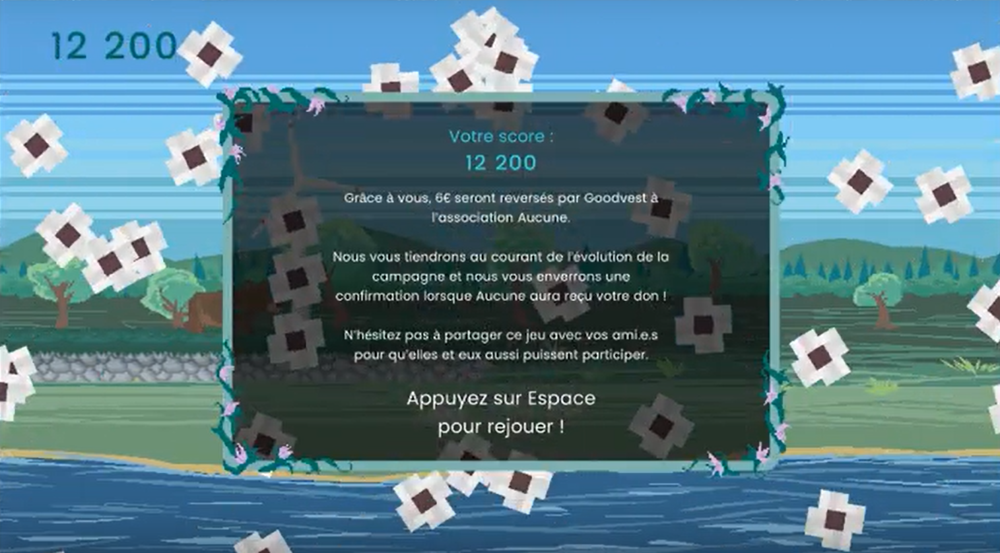

La première année de Mastère Game Programming à Rubika comprend un projet à destination de Steam

Ce projet est réalisé en coopération entre la filière Game Programming et la fillière Game Design, soit environ 40 élèves. L'organisation du projet est pensée pour reproduire l'organisation d'un studio, avec des trios chargés de développer les mini-jeux du Wario-Ware, des team leaders et des responsable du macro-jeu.

Cette mission a duré une semaine, j'ai intégralement réalisé le game design et la programmation de ce jeu sur **Unity**, en me basant sur le cahier des charges fourni par l'entreprise.