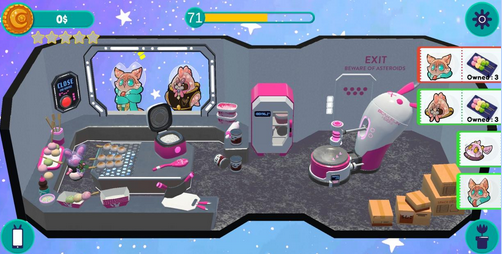
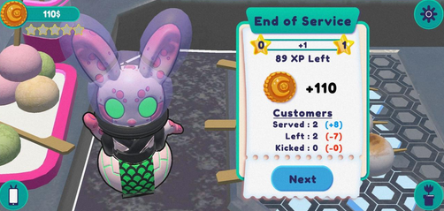

La dernière année de Bachelor Game Programming à Rubika comprend un projet de jeu mobile, s'étalant de février à juin 2022.

Ce projet est réalisé en coopération entre la filière Game Programming, la filière Game Art et la fillière Game Design, en équipes de 7 élèves.

Dans ce jeu on joue un lapin qui ouvre un food truck sur la lune. Il va devoir cultiver ses ingrédients, cuisiner les plats et servir les clients en réussissant des mini-jeux le plus rapidement possible pour gagner de l'argent et améliorer son food truck.

Dans ce projet j'ai pris le rôle de développeur gameplay et UI. Je me suis principalement concentré sur la partie liée aux objets ainsi qu'aux mini-jeux de cuisine et à leur optimisation.